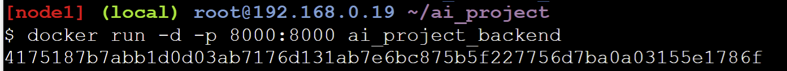
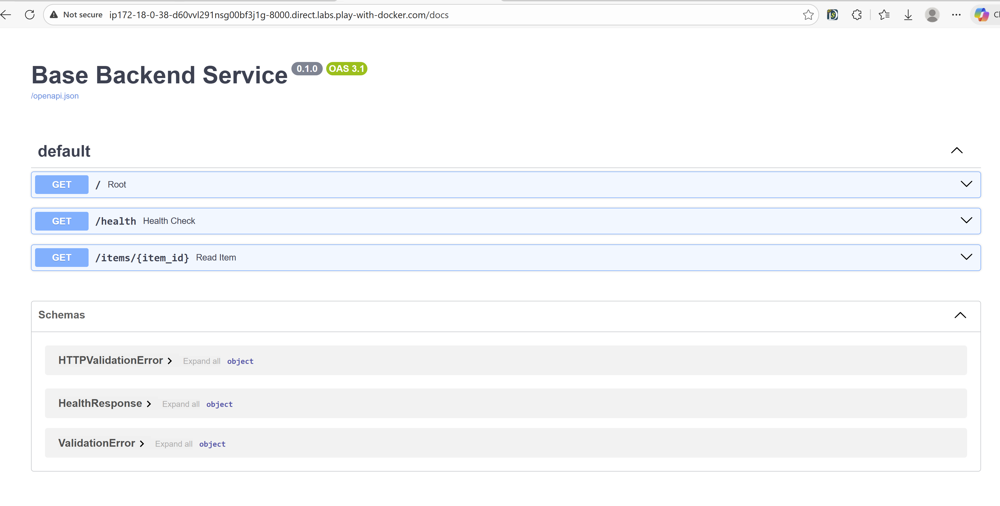
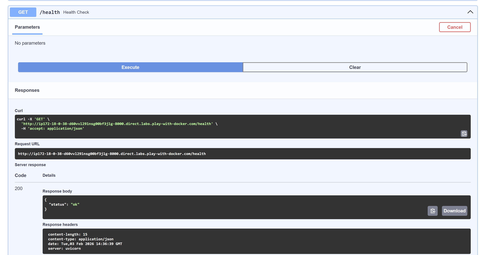
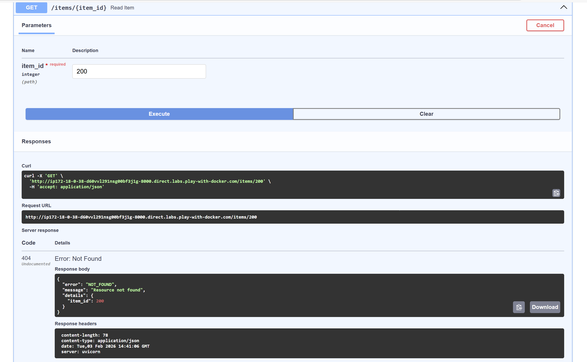

AI Project Backend Service – Technical Documentation
## 1. What is this project?
This project is an integrated Backend service developed using FastAPI. It is designed to serve as a robust infrastructure capable of hosting Artificial Intelligence models in the future.

The project focuses on:

Building a RESTful API with professional standards.

Organizing code according to a Layered Architecture.

Containerization: Ensuring the application runs in an isolated and stable environment using Docker.

Resolving advanced network and security hurdles encountered during the containerization process.

## 2. Tools & Technologies
Programming Language
Python 3.13-slim: The slim version was specifically chosen to minimize the container footprint.

Framework
FastAPI: Used for building the APIs with built-in support for automated documentation (Swagger) and data validation.

ASGI Server
Uvicorn: A high-performance server used to run the FastAPI application.

Version Control
Git & GitHub: The project is managed via feature-based branches (e.g., docker-support and api-health) to ensure organized development.

## 3.  Architecture
The project follows a simple Layered Architecture that clearly separates responsibilities:

API Layer → routes.py

Business Logic → services.py

Data Models → schemas.py

Error Handling → errors.py

Configuration → config.py

Application Boot → main.py

Architecture Explanation:
API Layer: Responsible for receiving HTTP requests and returning responses.

Service Layer: Contains the business logic, independent of the HTTP protocol.

Schemas: Defines data models and validates both inputs and outputs.

Error Layer: Manages expected errors through a centralized system.

Main Application: The entry point for running the application and wiring all components together.

This separation facilitates:

Code Readability

Component Testing

Future Scalability (such as adding a Database or an AI Model)

Component Testing

Future Scalability (such as adding a Database or an AI Model)

## 4.  Project Structure
The actual file organization in ai_project:

project-root/
│
├── app/
│ ├── init.py
│ ├── main.py # Entry point
│ ├── routes.py # API endpoints
│ ├── services.py # Business logic
│ ├── schemas.py # Request/Response models
│ ├── errors.py # Centralized error handling
│ └── config.py # Application configuration
│
├── Dockerfile
├── .dockerignore
├── .gitignore
├── requirements.txt
└── README.md

## 5.  Docker Deployment (Docker Run) 🐳
Due to local system constraints, Play with Docker (PWD) was successfully utilized to build and run the project.

Deployment Steps:
Build the Image:

Bash
docker build -t ai_project_backend .

Run the Container:

Bash
docker run -d -p 8000:8000 ai_project_backend

Note: The host was set to 0.0.0.0 within the container to enable external access.

## 🛠️ 6. Troubleshooting & Challenges
During the Dockerization process on a Windows environment, several persistent network and security hurdles were encountered. Despite attempting all standard technical solutions, the local environment remained restricted.

1. DNS Resolution Issues (Name or service not known)

The Problem: Docker containers were unable to resolve domain names (like pypi.org), preventing pip from downloading dependencies.

Attempted Solutions: Manually configured the Docker Engine daemon.json to use Google's Public DNS (8.8.8.8) and restarted the Docker service multiple times.

2. SSL Certificate Verification Errors (SSLCertVerificationError)

The Problem: Even after DNS tweaks, pip failed with SSL errors: "The certificate's CN name does not match the passed value."

Attempted Solutions: Updated the Dockerfile to mark official Python repositories as "trusted hosts" using the --trusted-host flag.

3. Persistent Local Environment Failure

The Outcome: Despite applying the aforementioned fixes (DNS configuration and SSL bypass), the local Windows Docker Desktop continued to block outgoing connections due to strict corporate/system firewall rules.

The Final Workaround: After exhausting all local troubleshooting steps without success, the project was successfully migrated to Play with Docker (PWD), a cloud-based Docker environment, where the build and deployment were completed seamlessly.

## 7. API Usage & Testing
Testing was conducted via the interactive Swagger UI (accessible at /docs).

Health Check:

Request: GET /health

Response: 200 OK -> {"status": "ok"}

Error Handling: The API correctly validates inputs, returning 400 for empty fields and 422 for structural errors.

 > Health endpoint returning 200 OK.
 > Centralized error response for 404 Not Found.
